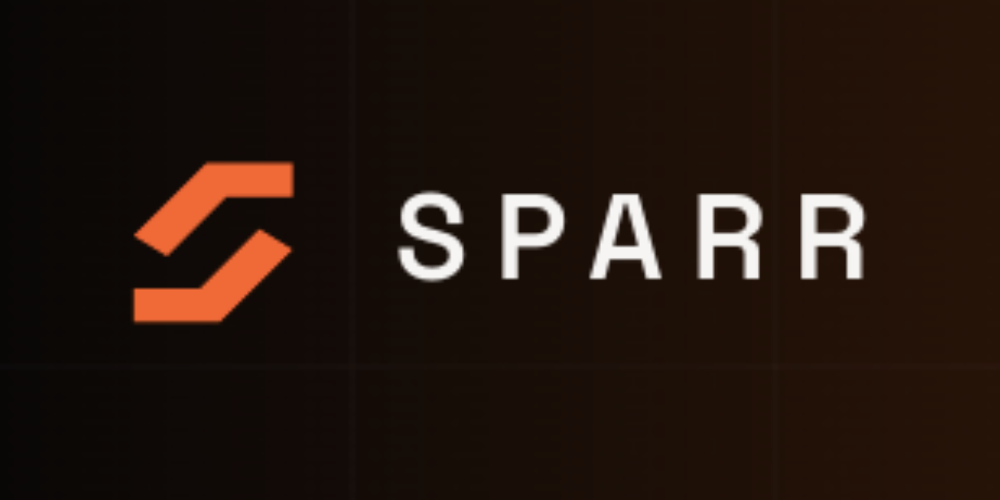
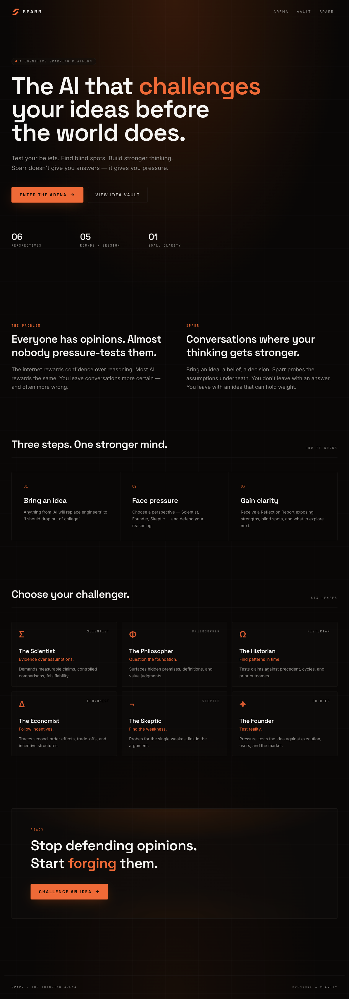
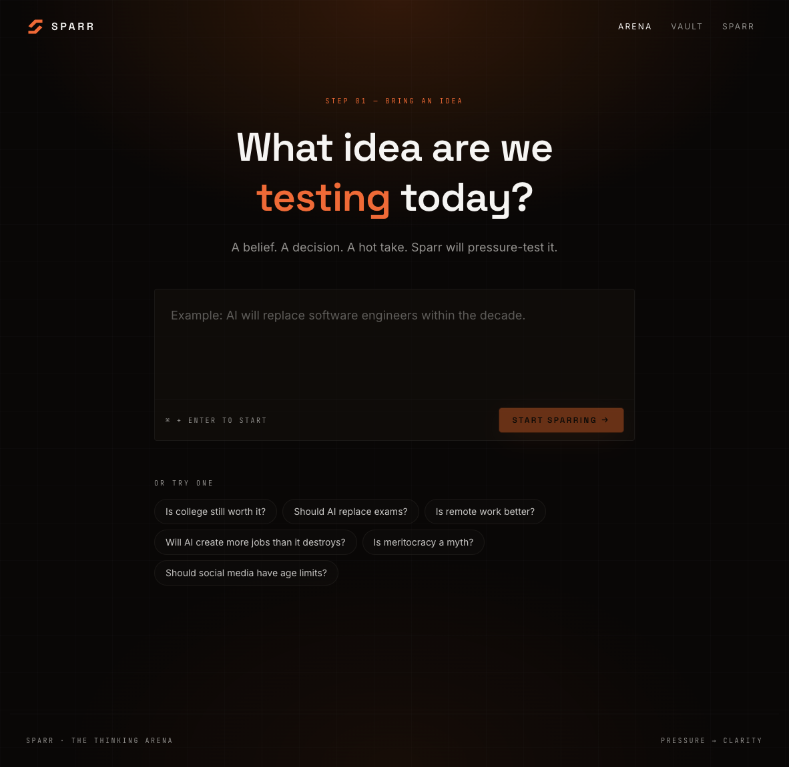
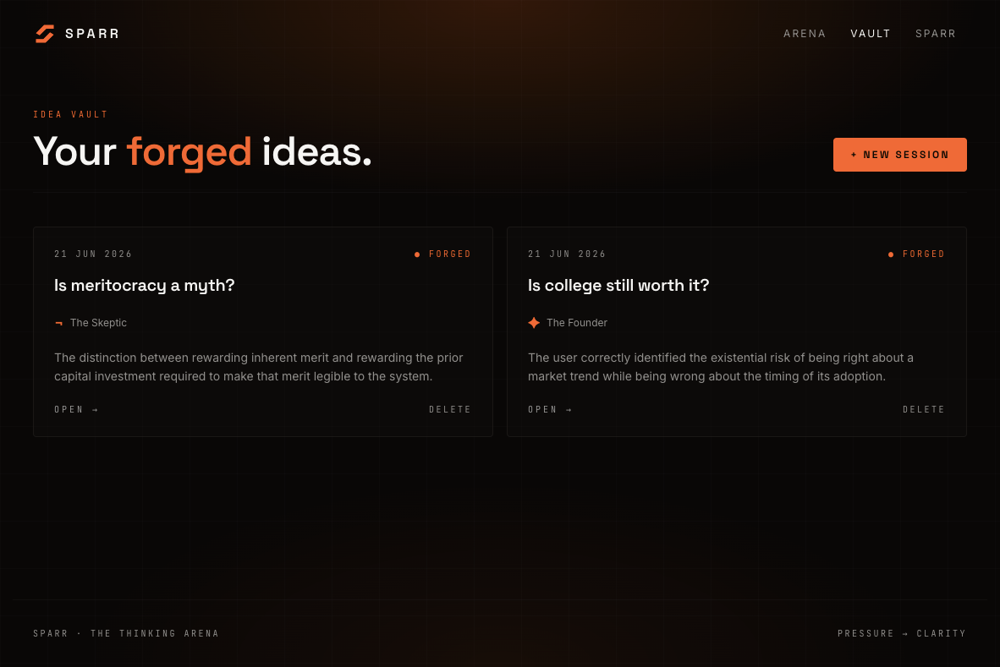
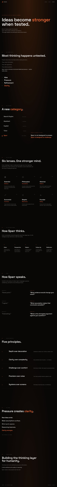

# SPARR

#### The AI that challenges your ideas before the world does.

> A thinking gym for ideas. A place where assumptions are tested, blind spots are exposed, and reasoning gets stronger through conversation.

---

## Quick Navigation

- [Why SPARR Exists](#why-sparr-exists)
- [What is SPARR?](#what-is-sparr)
- [Why I'm Building This](#why-im-building-this)
- [Screenshots](#screenshots)
- [Features](#features)
- [Tech Stack](#tech-stack)
- [Architecture](#architecture)
- [Project Snapshot](#project-snapshot)
- [Roadmap](#roadmap)
- [Building in Public](#building-in-public)
- [About the Builder](#about-the-builder)

---

## Why SPARR Exists

**Reality is undefeated.**

It doesn't care how confident you are.

It doesn't care how smart you sound.

It doesn't care how many people agree with you.

If an idea is weak, reality eventually finds the crack.

The problem is that most of us discover those cracks too late.

A startup after launch.

A decision after it's made.

A belief after it's tested.

An assumption after it fails.

We test software.

We test products.

We test airplanes.

We test bridges.

### But our ideas often go completely untested.

SPARR started from a simple question:

> #### What if ideas could be challenged before reality challenged them?

Not to prove people wrong.

Not to win arguments.

But to help people think more clearly.

To uncover blind spots.

To strengthen reasoning.

To pressure-test decisions before they become consequences.

## What is SPARR?

Athletes spar before stepping into the ring.

Not because they enjoy getting punched.

Because pressure reveals weaknesses before competition does.

Ideas deserve the same treatment.

SPARR is an AI Cognitive Sparring Platform.

You bring:

* an opinion
* a belief
* a startup idea
* a decision
* a career choice
* an argument
* a question

SPARR pushes back.

The goal isn't to tell you what to think.

The goal is to help you understand your own thinking better.

### A Simple Example

Imagine you state:

> "College is becoming useless."

A normal AI might explain college.

SPARR might ask:

> If college is becoming useless, why do employers still use degrees as a hiring filter?

Then:

> Are you criticizing education itself, or the current system?

Then:

> What evidence would change your mind?

The conversation isn't trying to win.

It's trying to find the strongest version of the idea.

Sometimes your belief gets stronger.

Sometimes it changes.

Sometimes it falls apart.

All three outcomes are useful.

## Why I'm Building This

I'm an engineering student.

Like most people my age, I grew up with unlimited information.

Google.

YouTube.

Social media.

AI.

Answers are everywhere.

Yet good thinking still feels rare.

The people I admire most aren't the people who know the most.

They're the people who think clearly.

They ask better questions.

They change their minds when evidence changes.

They can explain what they believe and why.

That's a skill worth building.

SPARR is my attempt to build a tool that helps with exactly that.


## Screenshots

### Logo


### Banner



### Homepage



### Sparring Arena



### Chat Vault



### About Sparr



## Features

### Cognitive Sparring

Bring any idea and challenge it through conversation.

Not debate.

Not argument.

Thoughtful pressure.

#### Multiple Thinking Perspectives

SPARR can explore ideas through different lenses:

* Scientist
* Philosopher
* Historian
* Economist
* Skeptic
* Founder

Each perspective looks for different strengths and weaknesses.

### Human Conversations

Good conversations don't feel like interviews.

One of the biggest goals of SPARR is making interactions feel natural, engaging, and genuinely useful.

### Blind Spot Discovery

Sometimes the most important thing isn't what you know.

It's what you've overlooked.

SPARR is designed to surface those missing angles.

###  Voice Sparring *(In Progress)*

Some ideas are easier to speak than type.

The long-term goal is simple:

Talk to SPARR like you'd talk to a thoughtful friend during a long walk.

## Tech Stack

Current stack:

### Frontend

* React
* TypeScript
* Tailwind CSS

### Backend

* Node.js
* Express.js

### Database

* Supabase

### AI Layer

* Gemini API

### Deployment

* Vercel
* Render

The stack will evolve.

## Architecture

At its simplest:

```text
Idea
 ↓
Challenge
 ↓
Reflection
 ↓
Clearer Thinking
```

Current system design:

```text
User
 ↓
SPARR Interface
 ↓
Human Conversation Engine
 ↓
Perspective Selection
 ↓
Challenge Generation Engine
 ↓
AI Model
 ↓
Reflection Layer
 ↓
Response
```

---

## Project Snapshot

Status: Early Development

Stage: Pre-Beta

Conversations Tested: 100+

Reasoning Perspectives: 6

Challenge Patterns: Growing

Started: 2026

**Website**: Coming Soon

**Public Beta**: Coming Soon

### Current Challenges

Building SPARR is less about making AI intelligent and more about making AI useful.

Current problems being explored:

- Making challenges understandable by everyone
- Creating natural conversations
- Avoiding generic AI responses
- Building adaptive reasoning systems
- Designing voice-first sparring experiences

### Current focus:

* Human Conversation Engine
* Challenge Library
* Voice Sparring
* Language Adaptation System
* Reasoning Quality

## Roadmap

### Version 1

Build a genuinely useful cognitive sparring experience.

If a user leaves a conversation thinking:

> "That made me think differently."

That's a win.

### Version 2

Personalized thinking profiles.

SPARR begins understanding:

* how you reason
* where you struggle
* what challenges help you grow

### Version 3

A complete thinking gym.

A place where people come to:

* sharpen ideas
* improve decisions
* prepare arguments
* explore beliefs
* become better thinkers

## Building in Public

This repository is not a finished product.

It's a record of the journey.

The ideas.

The experiments.

The mistakes.

The improvements.

Some assumptions in this README will probably be wrong. That's fitting.

After all, SPARR exists to challenge assumptions, including my own.

### About the Builder

Hi, I'm **Drishti**.

I'm a 19-year-old engineering student and a builder interested in AI, product design, education, and systems thinking.

I learn by building.

SPARR started as a question in my notes:

> What if AI could challenge ideas instead of simply answering questions or agreeing upon our arguements?

I'm building this project to explore that question.

This repository documents that journey.

---

## Reality eventually tests every idea.

## SPARR exists so we can test them first.
